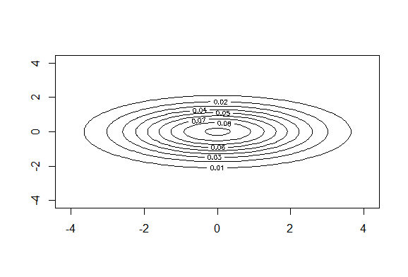
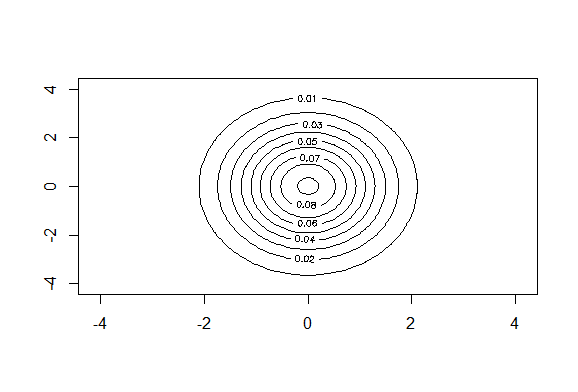
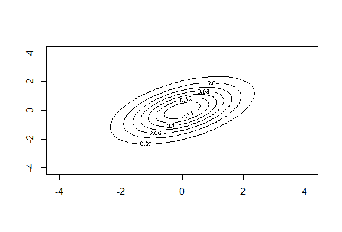

# Байесовские алгоритмы классификации
В настоящее время статистические методы широко применяются для классификации текстов по признакам авторского, жанрового, гендерного и других  стилей. Байесовская  теория  принятия  решений  составляет  основу статистического  подхода  к  задаче  классификации  объектов.Этот  подходоснован на предположении, что задача выбора решения сформулирована в терминах  теории  вероятностей  и  известны  все  представляющие  интерес вероятностные  величины. В  основе  байесовской  классификации  лежит правило Байеса.
### Нормальный дискриминантный анализ
Это метод классификации, основанный на параметрическом подходе, специальный случай, при котором плотности распределения всех классов полагаются многомерными нормальными.  
, где  
 - объект, состоящий из *n* признаков  
 - мат. ожидание каждого признака  
 - матрица ковариации признаков. Симметричная, невырожденная, положительно определённая.  
#### 1. Линии уровня нормального распределения
1. Если признаки некоррелированы, т. е. матрица ковариации диагональна, то линии уровня имеют форму эллипсоидов, параллельных осям координат, вытянутых относительно признака, значение для которого в матрице выше.





2. Если признаки коррелированы, то есть матрица ковариации не диагональна, то линии уровня имеют форму эллипсоидов, наклонённых относительно осей координат.



Если предположить, что все признаки объектов выборки сформированы независимо, то значение функции плотности  для класса *y* для объекта *x* можно представить в виде , где  - *i*-й признак объекта *x*. Это упрощает задачу, так как оценивать несколько одномерных плотностей легче, чем одну многомерную.  
Однако, на практике такая ситуация встречается редко, поэтому алгоритм получил название "Наивный байесовский классификатор". Обычно он используется, как эталон при сравнении различных алгоритмов классификации.  
Решающее правило принимает вид:  
  
#### 2. Наивный байесовский классификатор  
Наивный байесовский классификатор – это семейство алгоритмов классификации, которые принимают одно допущение: каждый параметр классифицируемых данных рассматривается независимо от других параметров класса.  
  Метод называется наивным т.к. предполагается, что все параметры набора данных независимы, что встречается крайне редко.  
  Обычно он используется, как эталон при сравнении различных алгоритмов классификации.  
Решающее правило принимает вид:  
  


### Подстановочный (Plug-in) алгоритм
Алгоритм относится к нормальному дискриминантному анализу и применяется для многомерных (в данном случае - для многомерного нормального) распределений.  
Решающее правило имеет вид:
, где  - восстановленные вероятность и плотность распределения класса соответственно.  
  
  
где  - восстановленная матрица ковариации.
Матрица ковариации вычисляется по формуле:  
  
Для математического ожидания 𝜇, то есть находим центр нормального распределения элементов класса:  

```diff  

  for (col in 1:cols){
   mu[1, col] = mean(objects[,col])
  }


```  
Для восстановления ковариационной матрицы 𝛴:  

```diff  

  for (i in 1:rows){
    sigma <- sigma + (t(objects[i,] - mu) %*% (objects[i,] - mu)) / (rows - 1)
  }


```     
Полученные матрицу ковариации и вектор мат. ожиданий подставляют в формулу плотности, которую, в свою очередь, подставляют в решающее правило. Поэтому алгоритм получил название "Подстановочный".  

Алгоритм позволяет построить разделяющую кривую между классами, решив уравнение:  
  
Это уравнение, при раскрытии переменных, превратится в уравнение кривой второго порядка, при подстановке точек, в которое, получим разделяющую кривую между классами.
Примеры работы алгоритма:
